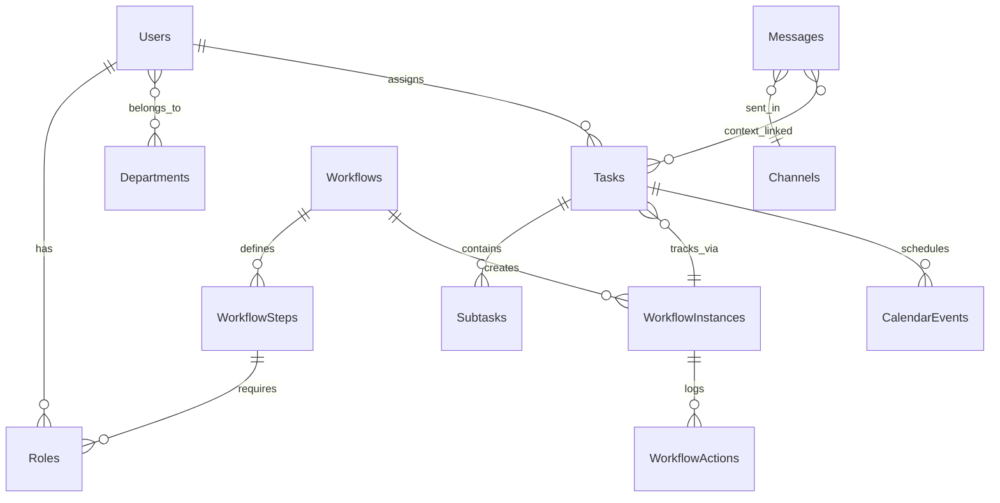

# FlowPilot – Unified Enterprise Workflow Management System

## 1. System Architecture Overview
FlowPilot is designed as a highly scalable, stateless, and event-driven enterprise application. To meet production readiness, we use a Service-Oriented (Layered) Monolith designed for easy transition to microservices. 

### Core Tech Stack
* **Backend:** Python + Django (Django REST Framework)
* **Frontend:** React + Vite + TypeScript, tailored with custom Vanilla CSS & styled layouts for a dynamic, premium appearance.
* **Database:** PostgreSQL (currently abstracting over SQLite config locally) + Redis (Pub/Sub & Caching).
* **Real-time Layer:** Django Channels (WebSockets) for real-time chat, workflow state updates, and notifications.

### Architectural Layers
1. **API Layer (Controllers):** Handles routing, request parsing, authentication logic, and standard HTTP/REST or WebSocket responses.
2. **Business/Service Layer:** Contains domain-specific rules (Task Lifecycle, Workflow Transitions, Permissions). Keeps controllers clean.
3. **Engine Layer:** A sub-layer for the **Workflow Engine**, effectively a finite-state machine (FSM) handler processing transitions and actions securely.
4. **Data Access Layer (Repositories):** Manages DB models, ORM calls, query optimizations.

---

## 2. Database Schema (Normalized Relational)



### Core Entities:
* **Users:** `id`, `name`, `email`, `password_hash`, `role_id`
* **Roles:** `id`, `name`, `permissions` (JSON)
* **Departments/Teams:** `id`, `name`, `parent_id` (hierarchical)
* **Tasks:** `id`, `title`, `description`, `status` (TODO, IN_PROGRESS, BLOCKED, DONE), `priority`, `assignee_id`, `reporter_id`, `workflow_instance_id`
* **Workflows (Templates):** `id`, `name`, `description`, `is_active`
* **WorkflowSteps:** `id`, `workflow_id`, `step_order`, `name`, `required_role_id`, `action_type`
* **WorkflowInstances:** `id`, `workflow_id`, `current_step_id`, `status` (PENDING, ACTIVE, COMPLETED, REJECTED)
* **WorkflowActions (Audit):** `id`, `instance_id`, `step_id`, `user_id`, `action` (APPROVE, REJECT, MODIFY), `timestamp`, `comments`
* **Channels/Chats:** `id`, `name`, `type` (DIRECT, TEAM, CONTEXTUAL), `context_id` (Polymorphic: Task or Workflow)
* **Messages:** `id`, `channel_id`, `sender_id`, `content`, `timestamp`
* **CalendarEvents:** `id`, `title`, `start_time`, `end_time`, `user_id`, `linked_task_id`, `linked_workflow_id`

---

## 3. Backend Structure & Key Components

In a realistic environment, our Django directory translates to:
```text
backend/
├── apps/
│   ├── account/          # Users, Roles, Departments, JWT Auth
│   ├── task/             # Tasks, Kanban logic, Subtasks
│   ├── workflow/         # Core engine, Templates, Instances, Approvals
│   ├── communication/    # Channels, DMs, Threads, WebSockets
│   ├── calendar/         # Deadlines, Scheduling, Meeting Conflicts
│   └── notification/     # Real-time WebSockets & Push events
├── core/
│   ├── exceptions.py     # Global error handling
│   └── permissions.py    # RBAC logic
└── manage.py
```
**Key Components:**
* `WorkflowTransitionManager`: An idempotent service responsible for executing transition actions. Rolls back step state if sub-actions fail.
* `SlaTrackerDaemon`: A Celery (or async) periodic task evaluating step limits against `SLA` configurations, creating escalation tasks and notifications automatically.

---

## 4. API Endpoints

### Auth Request/Response
* `POST /api/v1/auth/login` → `{ "token": "jwt...", "refresh": "jwt...", "user": {...} }`

### Tasks
* `GET /api/v1/tasks/` (Query params: `?status=IN_PROGRESS&assignee=me`)
* `POST /api/v1/tasks/` → Creates task and auto-generates context Chat Channel.
* `PATCH /api/v1/tasks/:id/` → Updates task, fires socket event.

### Workflows (Engine)
* `GET /api/v1/workflows/templates/` → List available definitions.
* `POST /api/v1/workflows/instance/` → Instantiates a workflow template.
* `POST /api/v1/workflows/instance/:id/action/`
   * **Payload:** `{ "action": "APPROVE", "comments": "Looks good." }`
   * **Engine validation:** Verifies user role vs `current_step.required_role_id`.

### Communication
* `GET /api/v1/chat/channels/:id/messages/`
* `POST /api/v1/chat/channels/:id/messages/` → Emits WebSockets to all listeners.

### Calendar
* `GET /api/v1/calendar/events/`
* `POST /api/v1/calendar/sync/`

---

## 5. Workflow Engine Logic Explanation

The Workflow Engine operates on a strict **Finite State Machine**.
1. **Definition:** A Workflow Template contains sequential or parallel Steps. Each step designates a `required_role` (e.g., "Finance Manager").
2. **Instantiation:** When a WorkflowInstance is created, its state is initialized. SLA timers begin.
3. **Execution Logic:** 
   - A user submits an `action` payload (APPROVE/REJECT).
   - The Engine intercepts it and checks: `if current_user.role != current_step.required_role: return PermissionDenied`.
   - If **APPROVE**: `current_step_id` advances to the next step index. A notification targets users mapped to the *next* step's role.
   - If **REJECT**: The instance halts, moves backwards (rollback policy), or enters `ESCALATED` state based on the template.
4. **Audit Trailer:** Every transition inserts an immutable record into `WorkflowActions`.
5. **Coupling:** When an instance is attached to a Task, completing the final workflow step auto-transitions the Task status to "DONE".

---

## 6. Frontend Structure

FlowPilot uses React. The layout requires high-fidelity aesthetics, utilizing glassmorphism, precise animations, and dark/light dynamic styling.

```text
frontend/src/
├── components/
│   ├── common/         # Buttons, Modal, Tooltips, Cards (Premium CSS styling)
│   ├── layout/         # Sidebar, Topbar, MainWrapper (Responsive)
│   └── communication/  # ChatWidget, ThreadView
├── features/
│   ├── dashboard/      # Analytics, Overview
│   ├── tasks/          # KanbanBoard, TaskCard, TaskDetail
│   ├── workflow/       # WorkflowCanvas (React Flow), InstanceTracker
│   └── calendar/       # React Big Calendar wrapper
├── hooks/
│   ├── useAuth.ts
│   └── useWebSockets.ts
├── store/              # Context / Zustand / Redux for app state
├── styles/             # index.css (Variable tokens, glassmorphism, animations)
└── App.tsx             # Routes definition
```

**UX Requirements:**
* **Real-time Navigation:** Clicking a Task slides open a detail pane overlay. Inside, clicking "Discussion" slides open the linked Chat context. No page refreshes.

---

## 7. Data Flow Examples

**Scenario:** A new Purchase Request requires Team Lead & Finance approval.
1. User creates Task `Buy 10 Monitors` out of workflow template `Purchase Req`.
2. **System Flow:**
   - DB inserting Task -> returns `TaskID: 101`.
   - System auto-generates Contextual Chat Thread for `TaskID: 101`.
   - System instantiates WorkflowInstance `WF: 202` linked to `TaskID: 101`.
3. Notification Engine dispatches WebSocket event to user assigned "Team Lead" role: *"Action required on Purchase Req: Buy 10 Monitors"*.
4. **Action Flow:** Team Lead views Dashboard, clicks "Approve".
   - API hits `/workflows/instance/202/action/ {action: 'APPROVE'}`.
   - Workflow transitions current step to "Finance Review".
5. Auto-sync calendar: Event updated for Finance Manager's SLA (due in 24 hours).

---

## 8. Key Code Snippets (critical paths only)

### Backend: Workflow Engine Core Transition Handler
```python
# backend/apps/workflow/services.py
from django.db import transaction
from .models import WorkflowInstance, WorkflowAction, WorkflowStep
from apps.notification.services import notify_users_by_role

class WorkflowEngine:
    @transaction.atomic
    def execute_action(self, instance: WorkflowInstance, user, action: str, comments: str = ""):
        current_step = instance.current_step
        
        # 1. Validation
        if user.role != current_step.required_role:
            raise PermissionError("User role not authorized for this step.")
        
        # 2. Audit Trail
        WorkflowAction.objects.create(
            instance=instance, step=current_step,
            user=user, action=action, comments=comments
        )
        
        # 3. State Transition
        if action == "APPROVE":
            next_step = self.get_next_step(instance.workflow, current_step)
            if next_step:
                instance.current_step = next_step
                instance.status = "ACTIVE"
                # Subtask generation/notifications
                notify_users_by_role(next_step.required_role, f"Pending action required on {instance.id}")
            else:
                instance.status = "COMPLETED"
                instance.task.mark_as_done() # Link to task lifecycle
                
        elif action == "REJECT":
            instance.status = "REJECTED"
            # Configurable specific rollback logic goes here
            
        instance.save()
        return instance
```

### Frontend: Task Context Link Action (Zustand/React)
```tsx
// frontend/src/features/tasks/TaskCard.tsx
import { useChatStore } from '../../store/chatStore';

export const TaskCard = ({ task }) => {
  const { openChatPane } = useChatStore();

  const handleOpenDiscussion = () => {
    // Zero-refresh context switch
    openChatPane({
      contextId: task.id,
      contextType: 'TASK',
      threadName: `Discussion: ${task.title}`
    });
  };

  return (
    <div className="task-card glassy-hover">
      <h4>{task.title}</h4>
      <span className={`status-badge ${task.status}`}>{task.status}</span>
      <div className="actions">
         <button onClick={handleOpenDiscussion} className="btn-secondary">
           <i className="icon-message"></i> Discuss
         </button>
      </div>
    </div>
  );
};
```
